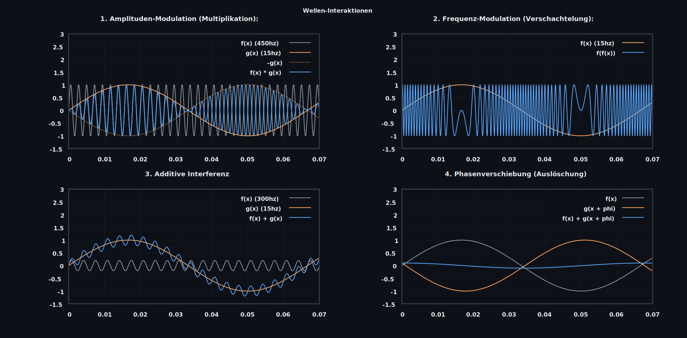
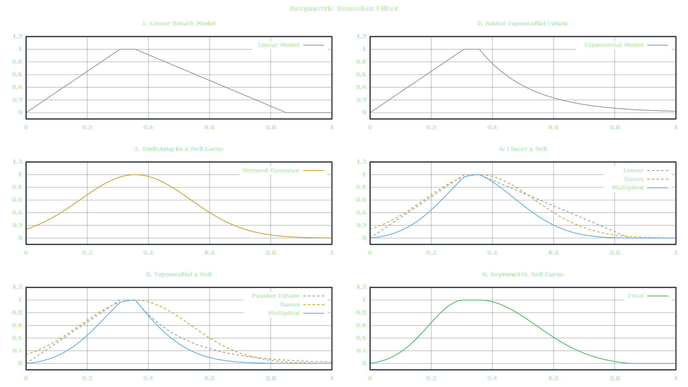
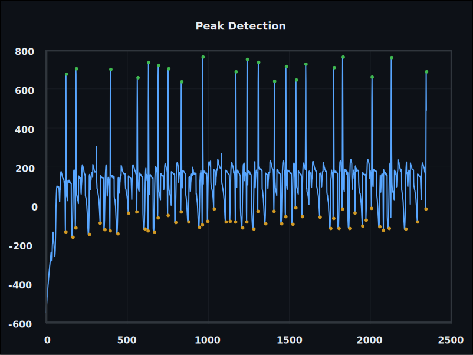
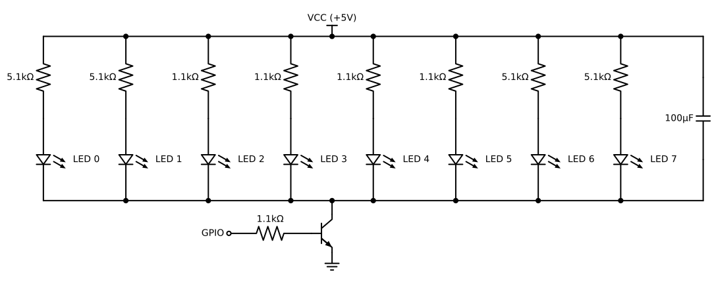

# *breezy:* 
## ~ *Ihr Meditationstrainer für die Hosentasche* ~

### Kurzbeschreibung:
  
***breezy*** ist ein eigenständiger, adaptiver Biofeedback-Meditationstrainer auf Basis eines ESP32.

***Ziel:***

Ein stand-alone Gerät, das sich automatisch mit einem Polar-Device verbindet, EKG- und Atemsignale (Brustkorbbewegung) erfasst, diese verarbeitet und in ein weiches, hochauflösendes PWM-Lichtsignal übersetzt.

Die Nutzererfahrung steht im Vordergrund; eine App dient primär zur Datenauswertung und zur Auswahl grundlegender Funktionen.

Das Projekt dient zugleich dem vertieften Verständnis von Algorithmen, Objekt-orientierter Programmierung, Signalverarbeitung und Embedded-Programmierung in C.

***Konzept:***

- Automatische Verbindung zu Polar-Sensoren
- Echtzeit-Signalverarbeitung für adaptives Biofeedback
- Dezente Lichtvisualisierung als Atem- und Entspannungsleitfaden
- Prototyping in Python auf einem Unihiker Ein‑Platinen‑Computer (Debian-basiert)
- finale Implementierung in C auf ESP32

### [***Prototyp 0.0.2***](./prototype_0.0.2/)

***Zielsetzung***:

Funktionsfähiger Python-Prototyp mit nicht-simuliertem Signal und adaptiver Lichtvisualisierung.

***Modellierung der Atemphasen als assymetrische Gauß-Glocke in gnuplot:***

***Visualisierung eines einfachen Algorithmus zur dynamischen Minimum/Maximum-Erkennung***

***Integration echter Biofeedback-Signale***

#### [Python](./prototype_0.0.2/python)

#### [Bash](./prototype_0.0.2/bash)

### [***Prototyp 0.0.1***](./prototype_0.0.1/)

https://github.com/user-attachments/assets/95bb95b5-2758-490a-abf5-11077871adc9

***Technische Umsetzung***

- Fokus: 
  - Einrichten des Entwicklungsboards und einer Test-Schaltung:
	- hohe Widerstandswerte dienen der Augenschonung
	- Kondensator wird je nach Testziel angepasst oder entfernt
  - Validierung grundlegender Programmierkonzepte
  - Erzeugung eines möglichst "weichen", hochauflösenden PWM‑Signals
  
- Prototyp-Sprache: Python

***Einschränkungen***

- PWM-Aktualisierungsrate ist auf 20-30Hz beim Unihiker begrenzt
- Atemmodellierung basiert auf einer symmetrischen Gauß-Kurve und ist noch nicht auf Atemphasen-/pausen skalierbar.
- Der Prototyp arbeitet mit ***simulierten*** Signalen.
- Entwicklung ist momentan an den Unihiker als Board gebunden.

### Kontakt und Mitwirkung

Beiträge, Feedback und Fragen sind willkommen.

